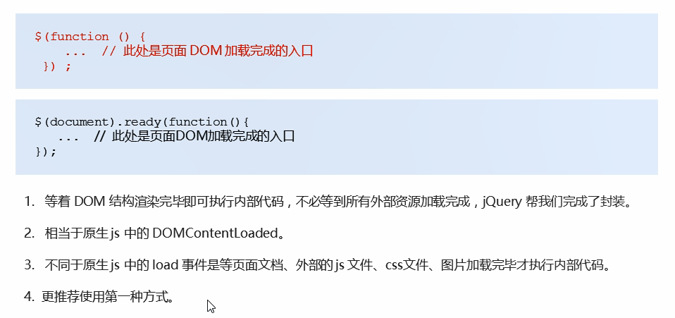
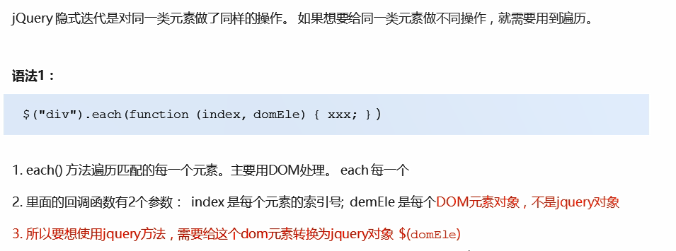

# jQuery

## 入口函数



## 顶级对象

* $ 是 jquery的别称，在代码中可以使用 jquery代替$,但一般为了方便，通常都直接使用$
* $ 是jquery的顶级对象，相当于原生 Javascript中的 window。把元素利用$包装成 Query对象，就可以调用
  jquery的方法

### jQuery对象和DOM对象

1. 用原生JS获取的对象是DOM对象，用jQuery获取的对象是jQuery对象
2. jQuery对象本质是：利用$对DOM对象包装后产生的对象（伪数组形式存储）
3. jQuery对象只能用jQuery方法，DOM对象则使用原生的JavaScript属性和方法

```javascript
myDiv.style.display = 'none';
myDiv.hide(); //myDiv是一个dom对象不能使用 jquery里面的hide方法
$('div').style.display = 'none'; //这个$('div')是一个jQuery对象不能使用原生js 的属性和方法
```

#### 互相转换


```javascript
//jQuery转换成DOM对象
$('video')[0].play()
$('video').get(0).play()
```

## 常用API

### 选择器


#### 隐式迭代

<strong style="color:red;">遍历内部DOM元素（伪数组形式存储）的过程就叫做隐式迭代</strong>。
简单理解：给匹配到的所有元素进行循环遍历，执行相应的方法，而不用我们再进行循环，简化我们的操作，方便我们调用

#### 筛选选择器

<strong style="color:red;">注意选第n个孩子是用:eq(n-1)，不是用[n-1]，注意！</strong>

#### 筛选方法


parents()可以返回指定的祖先元素

#### 链式编程

```js
$(this).css("color", "red").siblings().css("color", "");
```

### 样式操作


#### 类操作


### 效果


#### 显示隐藏


#### 滑动


#### 事件切换


如果只写一个，那么鼠标经过和离开都会触发

#### 停止动画排队


<strong style="color:red;">stop()必须写到动画的前面</strong>

#### 淡入淡出


#### 自定义动画


### 属性操作

#### 获取固有属性


#### 获取自定义属性

通过attr()


#### 数据缓存

不会修改DOM元素结构


### 内容文本值

#### 


### 元素操作

#### 遍历元素

**遍历DOM**



<strong style="color:red;">一定注意domEle是DOM对象</strong>

**遍历数据**


#### 创建元素


##### 内部添加

父子关系


element.preappend(“内容”) //添加到内部前面

##### 外部添加

兄弟关系


#### 删除元素


### 尺寸位置操作

#### 尺寸方法


#### 位置方法

##### offset相对文档


##### position相对父级


<strong style="color:red;">此方法只能获取，不能设置偏移</strong>

##### scrollTop被卷去


scrollLeft()被卷去左边

## 事件

### 事件注册


### 事件处理

#### 事件绑定


```js
$("div").on({
                mouseenter: function() {
                    $(this).css("background", "skyblue");
                },
                click: function() {
                    $(this).css("background", "purple");
                },
                mouseleave: function() {
                    $(this).css("background", "blue");
                }
            });
```

#### 事件委派

把原来子元素身上的事件绑定在父元素身上

绑定在ul上，但触发对象是li


#### 动态创建元素绑定事件

<strong style="color:red;">动态创建的元素， click()没有办法绑定事件，on()可以给动态生成的元素邦定事件，通过事件委派</strong>

#### 事件解绑


<strong style="color:red;">one()事件可以只触发一次</strong>

#### 自动触发事件


<strong style="color:red;">第三种不会触发元素的默认行为</strong>

### 事件对象


## 其他方法

### 对象拷贝


### 多库共存


## 插件


[jQuery插件库](http://www.jq22.com/)

[jQuery之家](http://www.htmleaf.com/)


# 源码解析


