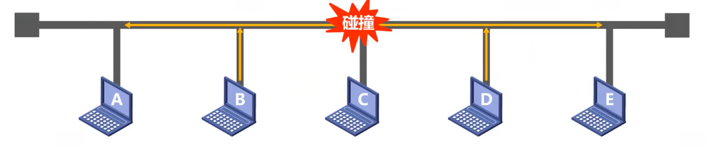
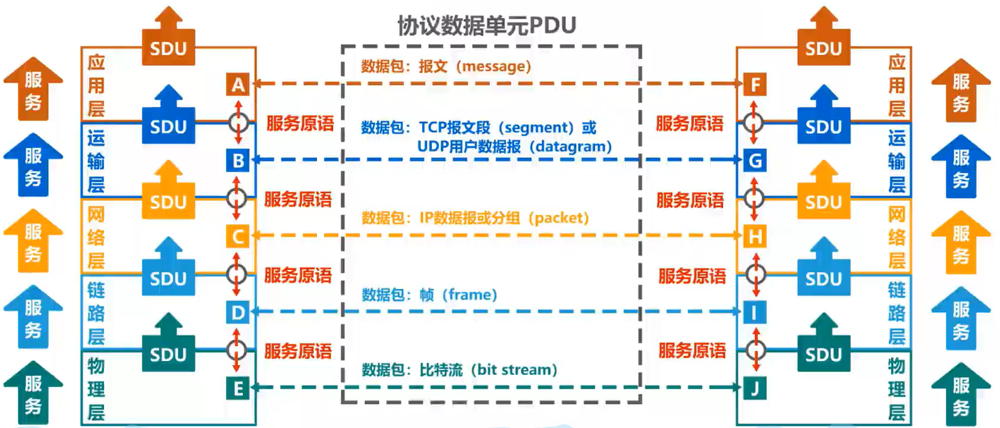
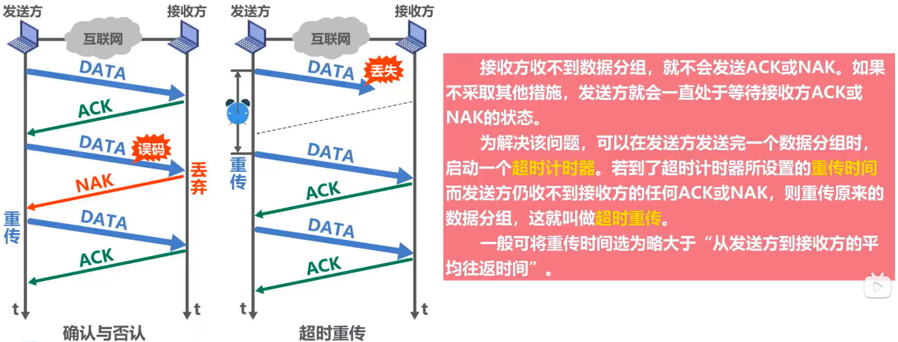
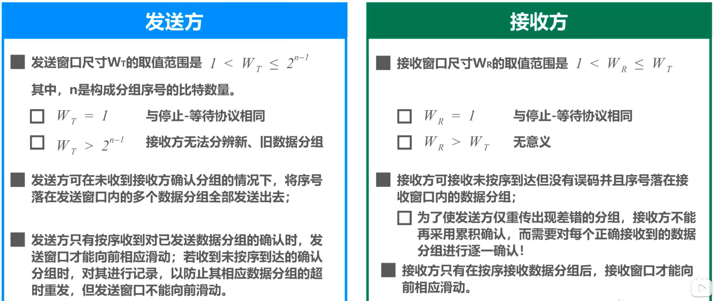

# 概述

网络是由若干结点和连接结点的链路组成的

多个网络通过路由器互联起来

因特网服务提供者(ISP)，比如移动、电信、联通

## 交换方式

* 电路交换：通过电话交换机接通电话线的方式
  * 主要分为三个步骤：建立连接（分配通信资源）、通话（占用资源）、释放连接（归还通信资源）

* 分组交换
  * 对报文拆分成等长数据段，称为包，并对数据添加首部
  * 首部保存了各种目的地的信息
  * 各个包通过**不同的路径**到达目的地，且到达目的地的时间是**乱序**的
  * 目的地再根据首部的信息还原数据

* 报文交换

三者区别和优劣：

## 性能指标

**速率**

**带宽**

**吞吐量**

* 单位时间内通过某个网络的数据量
* 吞吐量受网络的带宽或额定速率的限制

**时延**

* 发送时延 = 分组长度(b) / 发送速率(b/s)
* 传播时延 = 信道长度(m) / 电磁波传播速率(m/s)
* 处理时延(忽略)

**时延带宽积**

* 时延带宽积 = 传播时延 * 带宽
* 链路的时延带宽积又称为以比特为单位的链路长度

**往返时间**

**利用率**

**丢包率**

## 计算机网络体系结构

### 常见的体系结构

### 分层的必要性

**物理层的问题**

* 要采用怎样的传输媒体？
* 要采用怎样的物理接口？
* 要采用怎样的信号表示比特的 0 和 1？

**数据链路层的问题**

* 如何标识网路中的各个主机？(主机编址问题，例如 MAC 地址)
* 如何从信号所表示的一串比特流中区分出地址和数据？
* 如何协调主机争用总线？
* 以太网交换机是如何实现的？

**网络层的问题**

* 如何标识各网络以及网络中各主机？(网络和主机共同编址问题，例如 IP 地址)
* 路由器如何转发分组，如何进行路由选择？

**运输层的问题**

* 如何解决进程之间基于网络的通信问题？
* 出现错误时，如何处理？

**应用层的问题**

**总结**

**例子**

参考 https://www.bilibili.com/video/BV1c4411d7jb?p=9&spm_id_from=pageDriver

### 常用术语

# 物理层

物理层考虑怎样才能在连接各个计算机的传输媒体上传输数据比特流，为数据链路层屏蔽了媒介差异，只需考虑如何完成本层的协议和服务，而无需考虑媒介。

## 传输媒体

导引型：同轴电缆、双绞线、光纤、电力线

非导引型：无线电波、微波、红外线、可见光

## 传输方式

串行传输、并行传输

同步传输、异步传输

单工通信、半双工通信、全双工通信

## 编码与调制

常用编码方式

有了编码方式后，该如何将数字信号调制成模拟信号呢？

下面简介基本调制方法

但是使用基本调制方法，1个码元只能表示1个比特信息，所以可以使用正交振幅调制QAM，这样一个码元就可以表示4个比特信息

## 信道的极限容量

信号在信道里传输时会受到传输速率、传输距离、噪声干扰、传输媒体质量等问题而产生失真

因此在带宽一定的情况下，想提高信息的传输速率就必须采用**多元制（更好的调制方法）和努力提高信道中的信噪比**。

# 数据链路层

**链路**就是从一个结点到相邻结点的一段物理线路，而中间没有任何其他的交换结点

**数据链路**是指把实现通信协议的硬件和软件加到链路上，就构成了数据链路

数据链路以**帧**为单位传输和处理数据

## 封装成帧

* 对上层交付的协议数据单元添加帧头和帧尾使之成为帧
  * 帧头和帧尾包含控制信息
  * 帧头和帧尾的作用之一就是帧定界
* 透明传输是数据链路层对上层交付的没有任何限制，就好像数据链路层不存在一样
  * 面向字节的物理链路使用字节填充（或称字符填充）的方法实现透明传输
  * 面向比特的物理链路使用比特填充的方法实现透明传输

## 差错检测

* 实际的通信链路都不是理想的，比特在传输过程中可能会产生差错：1可能会变成0，而0也可能变成1。这称为比特差错。
* 在一段时间内，传输错误的比特占所传输比特总数的比率称为**误码率**BER(Bit Error Rate)。
* 使用**差错检测码**来检测数据在传输过程中是否产生了比特差错，是数据链路层所要解决的重要问题之一。

### 奇偶校验

* 在待发送的数据后面添加1位奇偶校验位，使整个数据（包括所添加的校验位在内）中“1”的个数为奇数（奇校验）或偶数（偶校验）
* 如果有奇数个位发生误码，则奇偶性发生变化，可以检查出误码
* 如果有偶数个位发生误码，则奇偶性不发生变化，不能检查出误码（漏检）

### 循环冗余校验CRC

* 收发双方约定好一个生成多项式G(x)
* 发送方基于待发送的数据和生成多项式计算出差错检测码（冗余码），将其添加到待传输数据的后面一起传输
* 接收方通过生成多项式来计算收到的数据是否产生了误码

## 可靠传输机制

### 停止-等待协议SW

  

* 接收端检测到数据分组有误码时，将其丢弃并等待发送方的超时重传。但对于误码率较高的点对点链路，为使发送方尽早重传，也可给发送方发送NAK分组
* 为了让接收方能够判断所收到的数据分组是否是重复的，需要给数据分组编号。由于停止-等待协议的停等特性，只需1个比特编号就够了，即编号0和1
* 为了让发送方能够判断所收到的ACK分组是否是重复的，需要给ACK分组编号，所用比特数量与数据分组编号所用比特数量一样。数据链路层一般不会出现
* ACK分组迟到的情况，因此在数据链路层实现停止-等待协议可以不用给ACK分组编号
* 超时计时器设置的重传时间应仔细选择。一般可将重传时间选为略大于“从发送方到接收方的平均往返时间”

### 回退N帧协议GBN

支持累计确认

### 选择重传协议SR

是回退N帧协议的扩展，接收窗口可以扩大，但是不支持累计确认，当接收窗口大小=1时退化成回退N帧协议

## 媒体接入控制

对于共享信道，要考虑如何协调多个发送和接受站点对一个共享传输媒体的占用，即为媒体接入控制 MAC

随机接入主要由以下几个协议实现：

## MAC地址、IP地址、ARP协议

### MAC地址

MAC 地址是用来对网络接口进行唯一标识的

一般情况下，用户主机会包含两个网络适配器：有线局域网适配器（有线网卡）和无线局域网适配器
(无线网卡）。每个网络适配器都有一个全球唯一的MAC地址。而交换机和路由器往往拥有更多的网络接口，所以
会拥有更多的MAC地址。综上所述，严格来说，**MAC地址是对网络上各接口的唯一标识，而不是对网络上**
**各设备的唯一标识**。

### IP地址

IP地址标识了两部分信息：

* 网络编号：标识因特网上数以万计的网络
* 主机编号：标识同一网络上不同的主机

### ARP协议

数据链路层如何从 IP 地址解析出 MAC 地址？

每台主机都有自己的 ARP 高速缓存表，来查询 MAC 地址，当查询不到时，就要发送 ARP 请求报文

ARP 协议只能在一段链路或一个网络上使用，不能跨网络使用

# 网络层

要解决的问题：

* 网络层向运输层提供怎样的服务
* 网络层寻址问题
* 路由选择问题

网络层提供的两种服务：

## IPv4地址

* IPv4地址就是给因特网(Internet)上的每一台主机（或路由器）的每一个接口分配一个在全世界范围内是唯一的32比特的标识符
* 32比特的1PV4地址不方便阅读、记录以及输入等，因此IPV4地址采用点分十进制表示方法以方便用户使用

### 分类编址的IPv4地址

**A类地址**

**B类地址**

**C类地址**

### 划分子网的IPv4地址

详细解释：

### 无分类编址的IPv4地址

例题：

## IP数据报的发送和转发过程

* 主机发送IP数据报

  * 判断目的主机是否与自己在同一个网络

    * 若在同一个网络，则属于直接交付

    * 若不在同一个网络，则属于间接交付，传输给主机所在网络的默认网关
      （路由器），由默认网关帮忙转发

* 路由器转发P数据报

  * 检查IP数据报首部是否出错
    * 若出错，则直接丢弃该IP数据报并通告源主机
    * 若没有出错，则进行转发：

  * 根据P数据报的目的地址在路由表中查找匹配的条目
    * 若找到匹配的条目，则转发给条目中指示的下一跳
    * 若找不到，则丢弃该P数据报并通告源主机：

## ICMP 协议

* 为了更有效地转发P数据报和提高交付成功的机会，在网际层使用了网际控制报文协议 ICMP(Internet Control Message Protocol)
* 主机或路由器使用ICMP来发送差错报告报文和询问报文
* ICMP报文被封装在IP数据报中发送。
* ICMP差错报告报文共有以下五种：
  * 终点不可达
  * 源点抑制
  * 时间超过
  * 参数问题
  * 改变路由（重定向）
* 以下情况不应发送ICMP差错报告报文：
  * 对ICMP差错报告报文不再发送ICMP差错报告报文
  * 对第一个分片的数据报片的所有后续数据报片都不发送ICMP差错报告报文
  * 对具有多播地址的数据报都不发送ICMP差错报告报文
  * 对具有特殊地址(如127.0.0.0或0.0.0.0)的数据报不发送ICMP差错报告报文
* 常用的ICMP询问报文有以下两种：
  * 回送请求和回答
  * 时间戳请求和回答
* ICMP 分组应用：
  * 分组网间探测 PING
  * 跟踪路由 tracert

## 虚拟专用网 VPN

* 利用公用的因特网作为本机构各专用网之间的通信载体，这样的专用网又称为虚拟专用网
* 同一机构内不同部门的内部网络所构成的虚拟专用网VPN又称为内联网VPN
* VPN要保证传输数据的安全性，会将原始的内部数据报进行加密，然后再将其封装成为在因特网上发送到的外部数据报
* 有时一个机构的VPN需要有某些外部机构（通常就是合作伙伴）参加进来。这样的VPN就称为外联网VPN
* 在外地工作的员工需要访问公司内部的专用网络时，只要在任何地点接入到因特网，运行驻留在员工PC中的VPN软件，在员工PC和公司的主机之间建立VPN隧道，即可访问专用网络中的资源。这种VPN称为远程接入VPN

## 网络地址转换 NAT

* 由于IP地址的紧缺，一个机构能够申请到的1P地址数量往往远小于本机构所拥有的主机数量。因此，虚拟专用网中的各主机所分配地地址应该是本机构可自由分配的专用地址，而不是需要申请的、在因特网上使用的公有地址
* 虽然因特网采用了无分类编址方式来减缓IP地址空间耗尽的速度，但由于因特网用户数目的激增，特别是大量小型办公室网络和家庭网络接入因特网的需求不断增加，IPV4地址空间即将面临耗尽的危险仍然没有被解除。
  1994年提出了一种网络地址转换NAT的方法再次缓解了1P地址空间耗尽的问题
* NAT能使大量使用内部专用地址的专用网络用户共享少量外部全球地址来访问因特网上的主机和资源
* 由于绝大多数的网络应用都是使用运输层协议TCP或UDP来传送数据，因此可以利用运输层的端口号和P地址一起进行转换。这样，用一个全球IP地址就可以使多个拥有本地地址的主机同时和因特网上的主机进行通信。这种将端口号和P地址一起进行转换的技术叫作网络地址与端口号转换NAPT(Network Address and Port Translation)
* 对于一些P2P网络应用，需要外网主机主动与内网主机进行通信，在通过NAT时会遇到问题，需要网络应用自己使用一些特殊的NAT技术来解决问题
* 由于NAT对外网屏蔽了内网主机的网络地址，能为内网的主机提供一定的安全保护

# 运输层

## 端口号、复用和分用

### 端口号

* 运行在计算机上的进程使用进程标识符PID来标志。
* 因特网上的计算机并不是使用统一的操作系统，不同的操作系统(vindows,Linux,Mac OS)又使用不同格式的进程标识符。
* 为了使运行不同操作系统的计算机的应用进程之间能够进行网络通信，就必须使用统一的方法对TCP/IP体系的应用进程进行标识。
* TCP小P体系的运输层使用端口号来区分应用层的不同应用进程。
  * 端口号使用16比特表示，取值范围0~65535;
    * 熟知端口号：0~1023,IANA把这些端口号指派给了TCP/P体系中最重要的一些应用协议，例如：FTP
      使用21/20,HTTP使用80,DNS使用53.
    * 登记端口号：1024~49151，为没有熟知端口号的应用程序使用。使用这类端口号必须在IANA按照规定的手续登记，以防止重复。例如：Microsoft RDP微软远程桌面使用的端口是3389.
    * 短暂端口号：49152~65535，留给客户进程选择暂时使用。当服务器进程收到客户进程的报文时，就知道了客户进程所使用的动态端口号。通信结束后，这个端口号可供其他客户进程以后使用
  * 端口号只具有本地意义，即端口号只是为了标识本计算机应用层中的各进程，在因特网中，不同计算机中的相同端口号是没有联系的。

## 复用和分用

## TCP

### 流量控制

* 一般来说，我们总是希望数据传输得更快一些。

  * 但如果发送方把数据发送得过快，接收方就可能来不及接收，这就会造成数据的丢失。
* 所谓流量控制(flow contro)就是让发送方的发送速率不要太快，要让接收方来得及接收。
* 利用滑动窗口机制可以很方便地在TCP连接上实现对发送方的流量控制。
  * TCP接收方利用自己的接收窗口的大小来限制发送方发送窗口的大小。
  * TCP发送方收到接收方的零窗口通知后，应启动持续计时器。持续计时器超时后，向接收方
    发送零窗口探测报文。

### 可靠传输的实现

* 虽然发送方的发送窗口是根据接收方的接收窗口设置的，但在同一时刻，发送方的发送窗口并不总是和接收方的接收窗口一样大。

  * 网络传送窗口值需要经历一定的时间滞后，并且这个时间还是不确定的。
  * 发送方还可能根据网络当时的拥塞情况适当减小自己的发送窗口尺寸。
* 对于不按序到达的数据应如何处理，TCP并无明确规定。
  * 如果接收方把不按序到达的数据一律丢弃，那么接收窗口的管理将会比较简单，但这样做对网络资源的利用不利，因为发送方会重复传送较多的数据。
  * TCP通常对不按序到达的数据是先临时存放在接收窗口中，等到字节流中所缺少的字节收到后，再按序交付上层的应用进程。
* TCP要求接收方必须有累积确认和捎带确认机制，这样可以减小传输开销。接收方可以在合适的时候发送
  确认，也可以在自己有数据要发送时把确认信息顺便捎带上。
  * 接收方不应过分推迟发送确认，否则会导致发送方不必要的超时重传，这反而浪费了网络的资源。
    TCP标准规定，确认推迟的时间不应超过0.5秒。若收到一连串具有最大长度的报文段，则必须每隔一个报
    文段就发送一个确认。
  * 捎带确认实际上并不经常发生，因为大多数应用程序很少同时在两个方向上发送数据。
* TCP的通信是全双工通信。通信中的每一方都在发送和接收报文段。因此，每一方都有自己的发送窗口和
  接收窗口。在谈到这些窗口时，一定要弄清楚是哪一方的窗口。

### TCP运输连接管理

#### 建立TCP连接

第三次握手不多余，是为了防止已知晓的连接请求报文突然又传送到了TCP服务器，导致错误

#### TCP的连接释放

两倍SML等待时间可以确保服务器关闭

